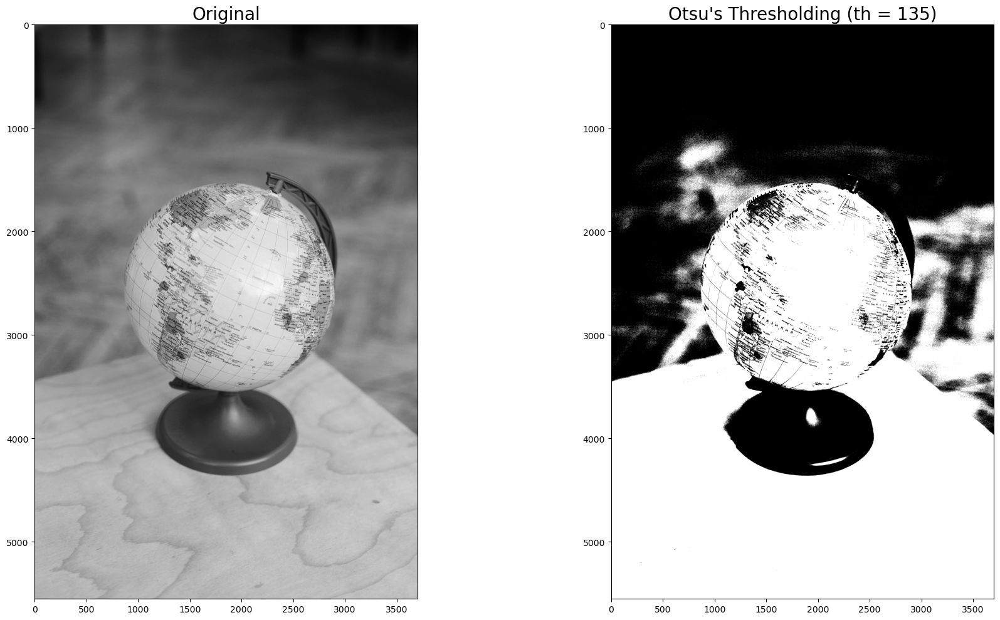

# 📊 Genetic Algorithm for Otsu Thresholding

This project implements a **Genetic Algorithm (GA)** to determine the optimal threshold for grayscale image segmentation based on the **Otsu method**. The algorithm uses **binary one-point crossover** and **binary mutation** to optimize threshold values beyond what conventional Otsu thresholding can achieve.

---

## 📸 Example Results

---

## 📑 Features

- 📥 Random population initialization within grayscale value range
- 🧮 Fitness evaluation based on Otsu’s intra-class variance criterion
- 🔀 One-point binary crossover between parent thresholds
- 🔄 Binary mutation with a 20% probability
- 🏁 Stopping criteria: maximum of 50 generations or when offspring converge to the same value
- 📊 Visualization of thresholding results

---

## 📝 Algorithm Workflow

1. Randomly initialize a population of threshold candidates.
2. Calculate the fitness value for each individual using the Otsu criterion.
3. Select the top individuals as parents.
4. Perform **binary one-point crossover** to generate offspring.
5. Apply **binary mutation** on offspring.
6. Update the population for the next generation.
7. Repeat until convergence or reaching the maximum generation.
8. Select the best threshold based on the fitness value.

---

## 📂 Project Structure

